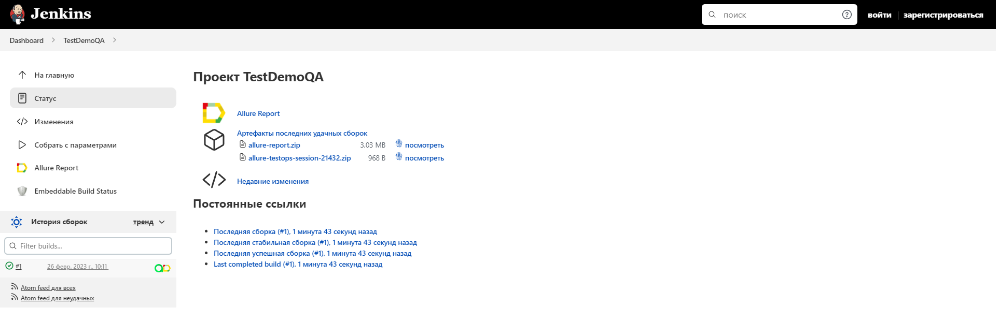
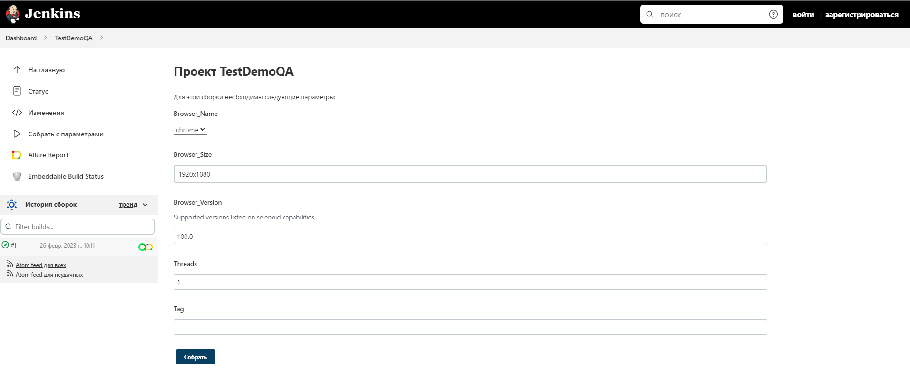
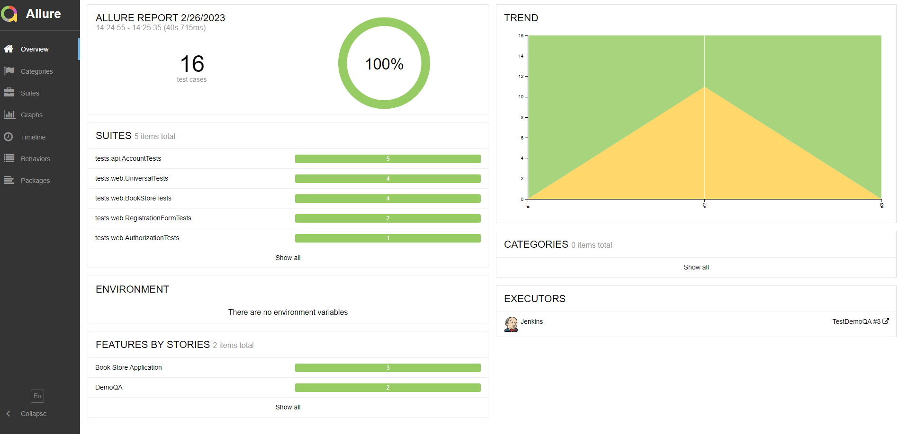
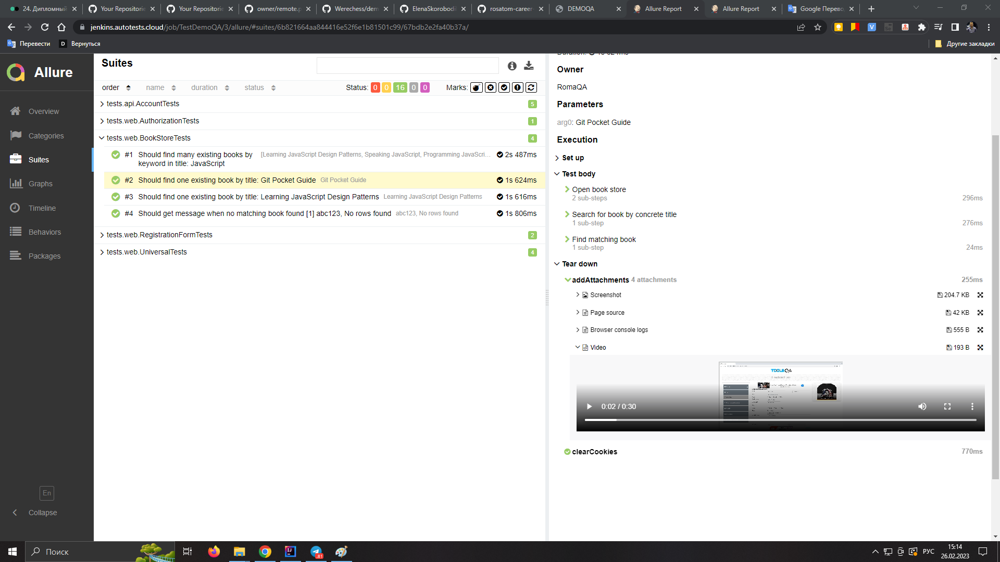
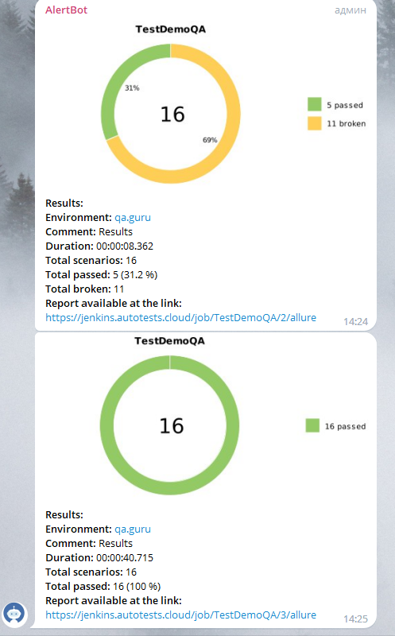
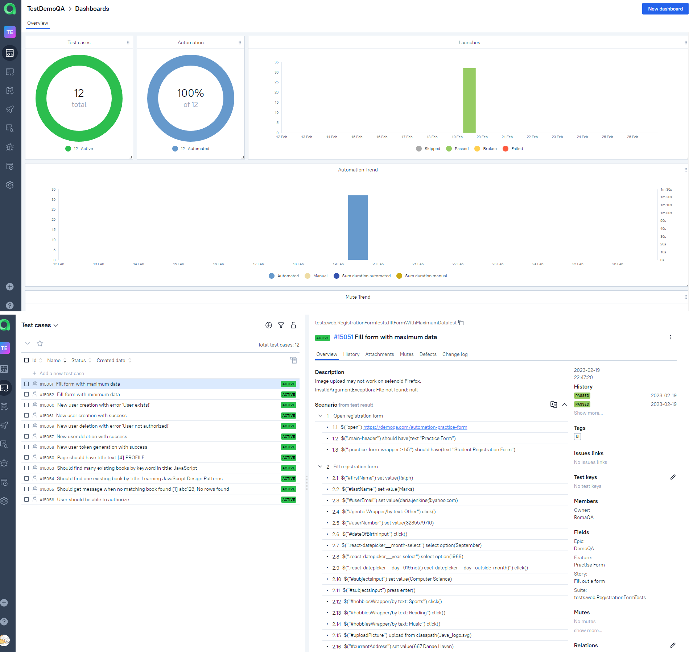

# Проект по автоматизации тестов на примере сайта [DemoQA](https://demoqa.com)


> DemoQA — это демо-сайт для QA-инженеров.\
> Сайт состоит из типичных web-форм, которые используются во всех сайтах, на примере книжного магазина с открытым API.

# <a name="TableOfContents">Содержание</a>

+ [Описание](#Description)
+ [Инструменты и технологии](#Technology)
+ [Запуск](#Jenkins)
    + [Gradle комманда](#GradleCommand)
    + [Запуск в Jenkins](#RunInJenkins)
+ [Telegram оповещения](#TelegramNotifications)
+ [Интеграция с Allure TestOps](#AllureTestOps)
+ [Видео запуска тестов](#Video)


# <a name="Description">Описание</a>
Тестовый проект состоит из UI и API тестов.

#### Список проверок, реализованных в UI автотестах:
- [x] Авторизация пользователя;
- [x] Поиск 1 книги;
- [x] Поиск нескольких книг по общему названию;
- [x] Наличие информационного текста, если книга не найдена;
- [x] Заполнение формы регистрации с максимальным и минимальным набором параметров;
- [x] Наличие требуемых заголовков в верхнем меню страницы.

#### Список проверок, реализованных в API автотестах:
- [x] Регистрация нового пользователя;
- [x] Регистрация существуюшего пользователя;
- [x] Проверка токена авторизации;
- [x] Успешное и неуспешное удаление пользователя.

#### Что особенного:
- [x] `Page Object` паттерн;
- [x] Генерация "случанных" данных с помощью библиотеки `Faker`;
- [x] Параметризованная сборка;
- [x] Config settings с использорванием библиотеки `Owner` ;
- [x] Использование `Lombok` модели в API тестах;
- [x] Сериализация/Десериализация API запросов через библиотеку`Jackson`;
- [x] `Allure TestOps` интеграция;
- [x] Реализован подход "Автотест - как документация";
- [x] Параллельный запуск.

# <a name="Technology">Проект реализован с использованием</a>

<p align="center">
  <code></code>
  <code></code>
  <code></code>
  <code></code>
  <code></code>
  <code></code>
  <code></code>
  <code></code>
  <code></code>
  <code></code>
  <code></code>
  <code></code>
</p>

Автотесты разработаны на `Java` с использованием `Selenide` фреймфорка.\
`Gradle` - сборщик проектов.  \
`JUnit5` - executor тестов.\
`REST Assured` - библиотека для упращения тестирования REST сервисов.\
`Jenkins` - CI/CD сервис для запуска тестов.\
`Selenoid` - удаленный запуск бразуерных тестов в `Docker` контейнерах.\
`Allure Report` - визуализация тестовых результатов.\
`Telegram Bot` - оповещения в телеграмме о результатах тестирования.\
`Allure TestOps` - Test Management System.


# <a name="HowToRun">Запуск</a>

## <a name="GradleCommand">Gradle command</a>

Для локального запуска тестов, можно воспользоваться командой:

```bash
gradle clean test
```

Дополнительные параметры:
> `-Dthreads=<количество_потоков>` - для запуска параллельных тестов\
> `-Denv=remote` - для запуска удаленных тестов, где remote = url установленый в файле remote.properties

`-Dtag=<tag>` - запуск тестов по тегам:
>- *api*
>- *ui*


## <a name="RunInJenkins">Запуск в Jenkins</a>

1. Открыть <a target="_blank" href="https://jenkins.autotests.cloud/job/TestDemoQA/">проект;</a>

Главная страница сборки:
<p align="center">

</p>

2. Выбрать пункт Собрать с параметрами;
<p align="center">

</p>

3. В случае необходимости изменить параметры, выбрав значения из выпадающих списков;
4. Нажать <Собрать>;
5. Результат запуска сборки можно посмотреть в отчёте Allure и AllureTestOps.

<p align="center">

</p>

Может быть показана полная информация о каждом тесте: теги, серьезность, продолжительность, подробные шаги.
Также доступны артефакты тестирования такие как:
>- Скриншоты
>- Page Source
>- Консольные логи
>- Видео выполнения теста

<p align="center">
  
</p>

# <a name="TelegramNotifications">Telegram оповещения</a>

Телеграм бот присылает краткий репорт о результатах тестирования после каждой сборки.

<p align="center">

</p>


# <a name="AllureTestOps">Полная статистика по прохождению тест-планов, отчёты и приложения к ним хранятся в Allure TestOps</a>

<p align="center">
  
</p>


# <a name="Video">Видео запуска тестов</a>

<p align="center">
  
</p>


